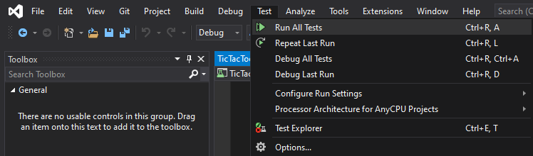
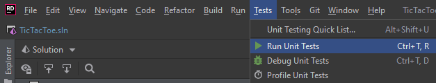

# Repository voor practicum 1A en 1B

## Practicum 1A

Zie [canvas](https://canvas.hu.nl/courses/20219/assignments/131846?module_item_id=522245) voor de opdracht. In practicum 1A is alleen het project `TicTacToeGui` van toepassing.

## Practicum 1B
Zie [canvas](https://canvas.hu.nl/courses/20219/assignments/131868?module_item_id=522566) voor de opdracht. Het `TicTacToeEngine` project is al aangemaakt, werk hierin verder.

### Tests

Er zijn een aantal tests die gedraaid kunnen worden die kunnen helpen met het implementeren van de TicTacToeEngine.

#### Tests draaien in Visual Studio

De tests kunnen gedraaid worden door in het menubalk op `Test` te klikken en vervolgens op `Run All Tests` te drukken. De key combinatie `Ctrl + R, A` kan ook gebruikt worden hiervoor.

#### Tests draaien in Rider

In Rider werkt het vrijwel op dezelfde manier, ook hier kan er van een key combinatie gebruikt worden: `Ctrl + T, R`

